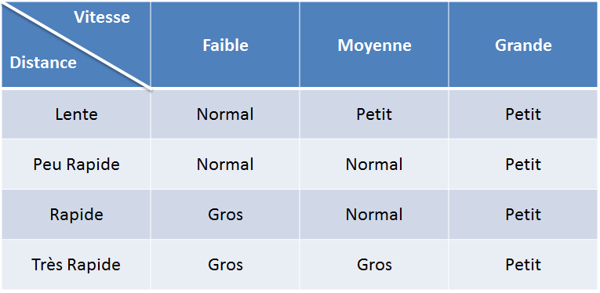
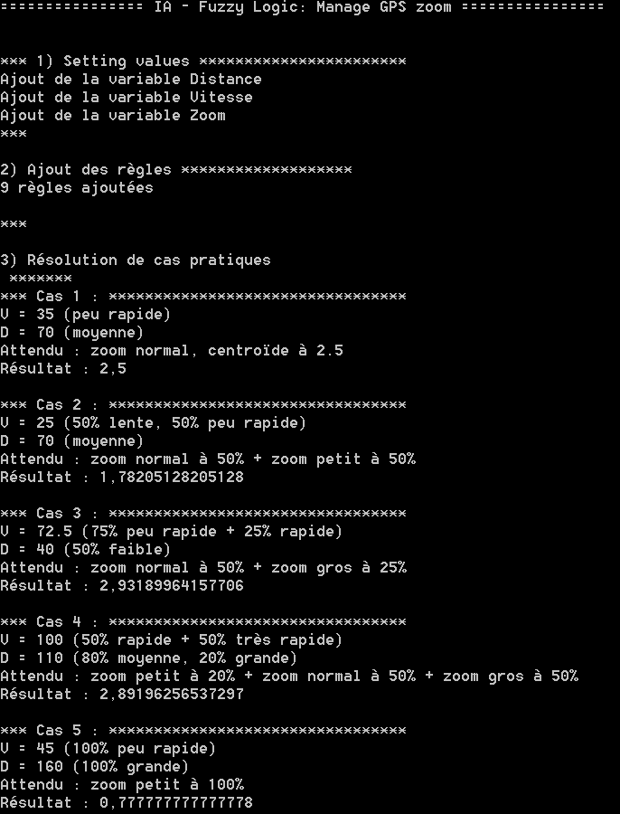

# Artificial Intelligence : Fuzzy Logic

Manage the GPS zoom automatically.

The level will depend on the car's speed (in km/h) and the next direction shift (in m).

The smaller the zoom is, the farther and less precise we are.

